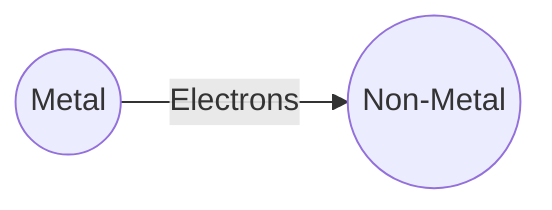
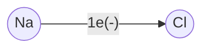
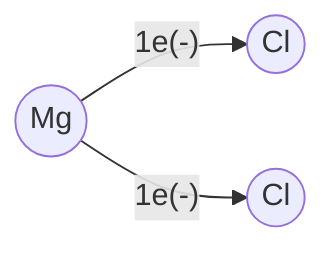
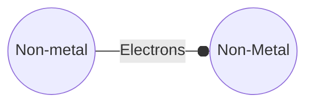

# Qustions
- What are compund bonds?
- Why do elements combine?
- Why is there a variable electronegativity of metals?
	- How does it work?
# -+
## Cations
- Cations are Metals with low En (electronegativity)
- when comined with non-metals, will lose $e^-$ for cations
### Fixed-charge cations:
#### Group 1 metals:
- will lose 1 valence $e^-$
- form (+1) cation
#### Group 2 metals
- will lose both valence $e^-$
- form (+2) cations
#### Group 3 metals
- form (+3) cations
- will loose 3 $e^-$
### Variable charge cations
> In variable charged cations, charge depends on the reactivity of the environment

- can form various charges
#### Transition metals (Group 4&5)
## Anions
### Monoatomic anions
- non-metals
- atom gains enough $e^-$ to fill the valence shell
#### Group 7 ($s^2p^6$ - up to $8e^-$)
- gains $1e^-$, forms (-1) anion
#### Group 6
- gains $e^-$, form (-2) anions
- gians 
# Types of Bonding:
# Ionic ($\text{Me} + \text{Nm}$)
|  |  |
|--|--|
|Atoms|$\text{Me} + \text{Nm}$|
| Connection | Strong |
|valence $e^-$|Transfer|

Ionic bonding happens within Metal + Non-metal compounds. Metals transfer electrons to non-metals

## $\text{NaCl}$
Na (+11) | $1s^22s^22p^6)3s^1$ 
|Na| Cl |
|--|--|
|Cation|Anion|
| loses $e^-$ | gains $e^+$ |
|(11+)$1s^22s^22p^6$|(17+)$1s^22s^22p^6$|
|11$p^+$|17$p^+$|
|10$e^-$|18$e^-$|

## $\text{Mg}\text{Cl}_2$

# Covalent ($\text{Nm} + \text{Nm}$)
|  |  |
|--|--|
|Atoms|$\text{Nm} + \text{Nm}$|
| Connection | Weaker |
|valence $e^-$|Share|

covalent bonding happens within Non-metal + Non-metal compounds. Non-metals share electrons. **They share electrons not equally!** One atom takes *"dominant"* position and has larger ownership on shared electrons than the others

# Metallic ($\text{Me}_n$)
|  |  |
|--|--|
|Atoms|$\text{Me}_n$|
| Connection | The weakest |
|valence $e^-$|Electronic cloud|

Metallic bonding happens within non-metals 

