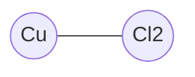
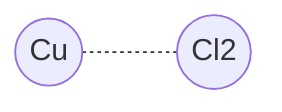
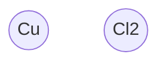
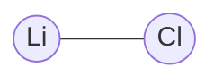
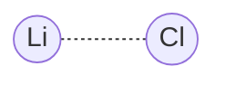
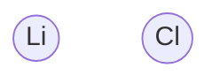

# Elements
## $\text{CuCl}_2$
### Element Color
| Before Burn | After Burn |
|--|--|
| Green | Orange (Natural Color of Cuprum) |
### Flame
- Green
- White/Bright Blue in the middle

## $\text{LiCl}$
### Element Color
| Before Burn | After Burn |
|--|--|
| White | Grey |
### Flame
- Pink flame
- White in the middle

## $\text{SrCl}_2$
### Element Color
| Before Burn | After Burn |
|--|--|
| White | Undefined (May or may not be on the rod) |
### Flame
- Orange
## $\text{FeCl}_2$
### Element Color
| Before Burn | After Burn |
|--|--|
| Black | Undefined (May or may not be on the rod) |
### Flame
- Sparkling metal sparks
- Sometimes goes blue

## $\text{NaCl}$
### Element Color
| Before Burn | After Burn |
|--|--|
| White | Undefined (May or may not be on the rod) |
### Flame
- Orange
- ~~Sometimes goes blue~~
## $\text{KCl}$
### Element Color
| Before Burn | After Burn |
|--|--|
| White | Undefined (May or may not be on the rod) |
### Flame
- blue-pink
- sometimes slightly sparkling
## $\text{CaCl}_2$
### Element Color
| Before Burn | After Burn |
|--|--|
| White | Undefined (May or may not be on the rod) |
### Flame
- Neon orange
- Rarely green
# My Hypothesis
## Observation
As fire gets in contact with the compounds, light of a certain spectrum is emitted. After burning $\text{CuCl}_2$ and $\text{LiCl}$ some powder becomes a different color.
## Conclusion
### Why has powder became a different color ?
#### Case of $\text{CuCl}_2$
By the changing color we can judge that a chemical reaction has happened. I suspect that $\text{CuCl}_2$ got separated $\text{CuCl}_2 \implies \text{Cu + Cl}_2$, because the powder became orange, which is a color of Cuprum (Copper).

#### Case of $\text{LiCl}$
By the changing color we can judge that a chemical reaction has happened. I suspect that $\text{LiCl}$ got separated $\text{LiCl} \implies \text{Li + Cl}$, because the powder became grey, which is a color of Lithium.

### Why is light emitted?
In "Why has powder became a different color?" I proved that the compound gets ripped apart on its sub elements. It means that the light is likely a result of "ripping apart".
What do we know about light?
-	Light is an electromagnetic wave
	-	Characteristics
		-	Spectrum is defined by energy (wave frequency)
From the definition of light I can conclude that the light emitted is a result of emitted energy.

What we know about the cause of this emition?
- Due to "ripping apart"
	- Why was it ripped apart?
		- Due to heat

What is heat?
- an electromagnetic wave

#### My hypothesis is:
When a heat wave reaches a compound it collides with its atoms and loses some energy. This lost energy is used to rip compounds apart. The leftover part of a heat wave changes has more energy, therefore has lower frequency. And the new lower (leftover) frequency is a frequency of a certain color in the visible spectrum. Some compounds are easier to rip apart than others, so they need less energy. This difference in energy (strength of the compound connection) creates different colors.
