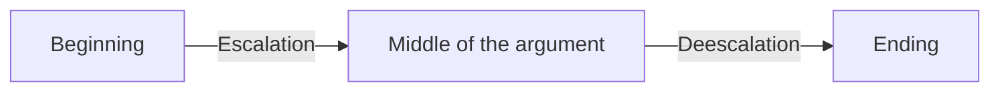
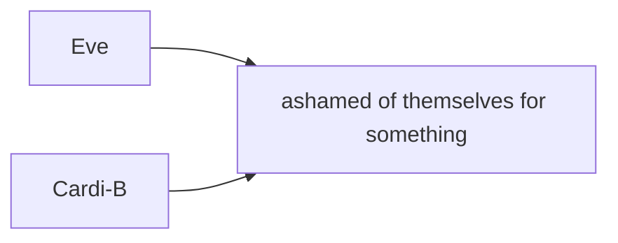

## Terminology
| Word | Means |
|--|--|
| Denotation | Literal meaning |
| Connotation | Abstract meaning |
| Slam Poetry | Marc Kelly Smith, 1980s. Chicago, Illinos. The goal: Poetry lost it's true passion, Bring poetry back to people (Poestry is for regular people too). Weekly poetry competition, where anyone could participate. People perform their work and get judged. There is one winner |

## The Method of Analysis
### 1. As you read, mark the following things as you notice them in the text.
- Repetition -> Words, phrases, details that repeat (Side note: Repetition reminds reader of the plot)
- Binary Opposition -> Words, phrases, images that are opoiste (dark/light, hot/cold)
- Anomalies -> Details that stand out because they're alone or only one
- Imagery -> words/phrasses that appeal to the five
	- sight
	- sound
	- taste
	- touch
	- smell

### 2. Look for and mark literacy/poetic devices
- Metaphor - a similie without "like" or "as"
- Similie - the comparison of one thing with another thing of a different kind, used to make a description more emphatic or vivid (e.g., _as brave as a lion_, _crazy like a fox_ ).
- Connotation/denotation - non literal/literal meaning of the word
- anaphora - Anaphora is a [figure of speech](https://www.litcharts.com/literary-devices-and-terms/figure-of-speech) in which words repeat at the beginning of successive clauses, phrases, or sentences. For example, Martin Luther King's famous "I Have a Dream" speech contains anaphora: "So let freedom ring from the prodigious hilltops of New Hampshire. Let freedom ring from the mighty mountains of New York. Let freedom ring from the heightening Alleghenies of Pennsylvania..."
- alliteration - repetition of sound
- allusion - an expression designed to call something to mind without mentioning it explicitly; an indirect or passing reference.
- prosonoification - given natural quality to artificial things

### What to ask yourself
#### What is the setting?
- What is the time
- Where did everything take place
- etc.
## Pre book

1. What do you notice
2. Look for
### Book cover
1. What do you notice?
	- The splashes of paint, the cover looks half photographed, half painted
		- Means something abstract, it is like an abstract painting
			- Abstract means chaotic
				- Chaotic means something complicated, like human mind
	- Awards book won (3)
		- Worth reading
	- Hair is made from splashes, whilst face is real
		- Transition to the abstract world
	- Face is white, hair is black. Contrast
	- DIfferent words and sentences on the face of a person.
		- words are distorted
			- they're unredable, like thoughts
	- The face is dim bright~~
	- A person (woman)
	- The face expression can be explained as "wonder"

A dim or bright
in full delight
from day to night
### Poems we gonna listen to
1.  Elizabeth Acevedo on Hair: [https://www.youtube.com/watch?v=0svS78Nw_yY](https://www.youtube.com/watch?v=0svS78Nw_yY)
- An argument tone (Pace)
	- This was really powerfull
- Proud of her hair (Proud of her history)
- "You can never fix what was never broken"
- Hair is a metaphore to cultural expression
- Repetition
	- My mother told me to fix my hair
		- this phrase is a signal to escalation and deescalation of the temper

- Plot:
	- My mother told her to to straighten her hair, but author says that it is to be proud of.
2.  Denise Frohman on Accents: [https://www.youtube.com/watch?v=qtOXiNx4jgQ](https://www.youtube.com/watch?v=qtOXiNx4jgQ)
What you notice?
- Accent is a sign of home.
- "Accent like a shotgun" - powerful, loud
- "Play-doh out of concrete English" - English not soft, not easily broken. (Metaphor)
- Body standarts
- "Language firing"
- "Piano keys in t"
- "Toung is a telegram" - Metaphor
- "Accent As a compas pointing way home" - Metaphor
- Calls mother "mama"
What do you think poem is about?
- "Holds accent like shotgun"
- Spanish Englihs fighting
- Don't know quite

3.  Elizabeth Acevedo fun facts: [https://www.youtube.com/watch?v=vdd9b3pfA-o](https://www.youtube.com/watch?v=vdd9b3pfA-o)
    
4.  Elizabeth Acevedo on her new poetry collection and “Self-Portrait of Eve as Cardi-B”: [https://www.youtube.com/watch?v=J5loBJmIYXM](https://www.youtube.com/watch?v=J5loBJmIYXM)
#### Connotations:
Eve - first woman. She has broke the Eden rule
Cardi-B - music, new femininity.

#### What do you notice?
- Yeah, I made it. I don't regret
- 
