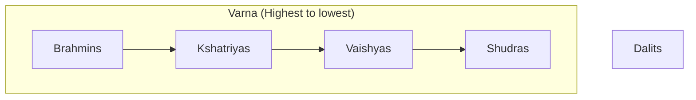
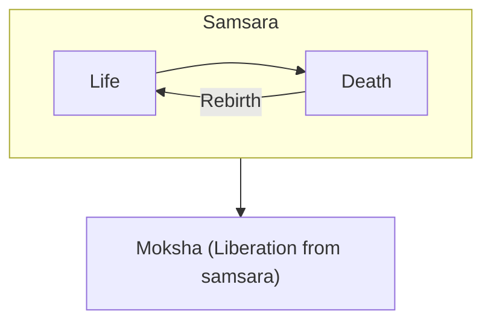

## Caste
### Varna (By birth):
(From highest to lowest)
1. Brahmins (Priests, teachers)
2. Kshatriyas (Warriers, rulers, kings, queens etc. (People Like Arjuna))
3. Vaishyas (Merchants, farmers)
4. Shudras (laborers, servants)
-----
- Dalits - outside caste system "untouchables". Ususually discriminated

### Jati (By occupation, aka guilds in europe)
- Candymaker
- etc.

-----
Dharma - duty, something that is excepted from you by gods.
Karma - sum of actions in this and previous lives, which dictates one's fate in future existences.
Samsara - cycle of birth, death, rebirth

## Threat of Buddism
Budism dictates:
- *"Doesn't matter who your parents are, it matters what you do"*
- *"The life is suffering, it is up to you do something with it"*
> Buddism destroys Induism caste system.

*"Cui bano?"* - Who benefits?
> The best society is designed by people who don't know what part they'd take in this society

The respond to the Threat is Gita.
