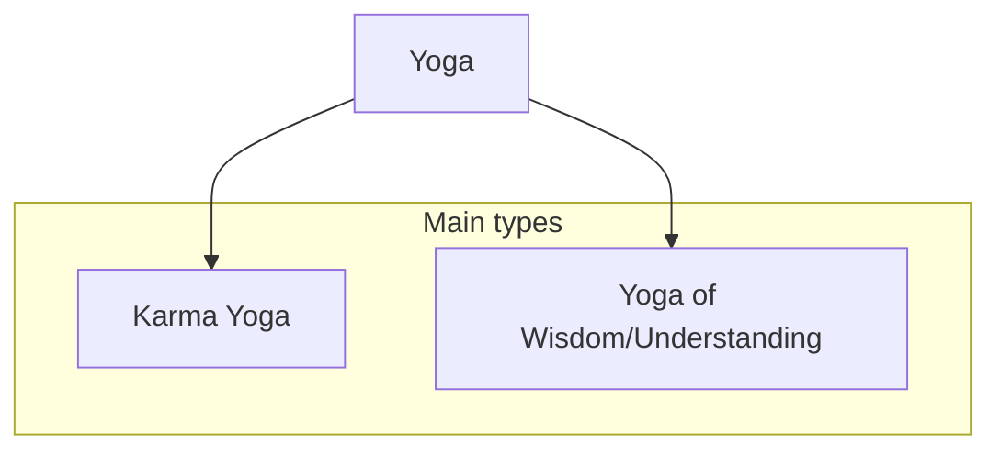

## Terminology
- Yoga -- path
- Karma -- action
- Mimetic **desire** -- aka peer pressure, but you're peer pressuring yourself ("my buddies would think that I am not cool if I not spray paint that wall").

## The most important things in chapters
- ### Chapter 1
	- Arjuna's dillema
- ### Chapter 2
	- 4 Arjuna's Responses
- ### Chapter 3
	- Karma yoga
	-	Important quote
		> It's better to do you your duty badly, than perfectly doing another's
## Types of Yoga

### Karma yoga
In short, **a path of detached action**.
What does it mean?
- Don't think about 
	- result
	- consequences
	- personal gain
- Just do it because you have to, focus on the task
