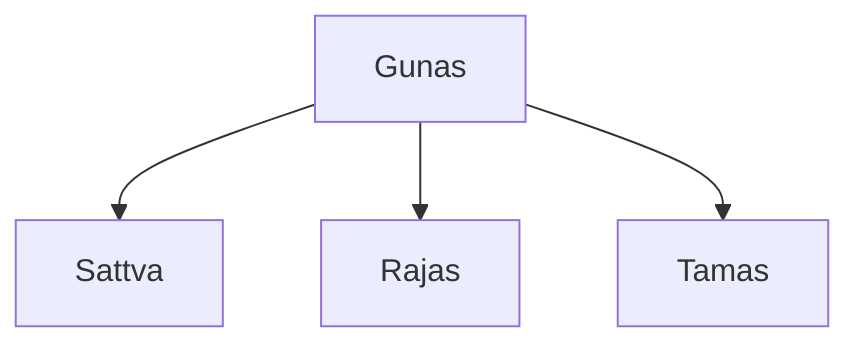

## Etymology
### Gunas
> Everything is made up from them

**There are 3 types:**
- Sattva (sattvic action)
	 - Purity, hollyness
	- Self is made from it.
- Rajas (rajasic action - too much emotion)
	- Activity, passion, Energy
- Tamas (tamasic action)
	-  Ignorrence, impurity

