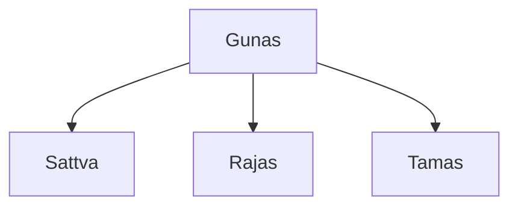
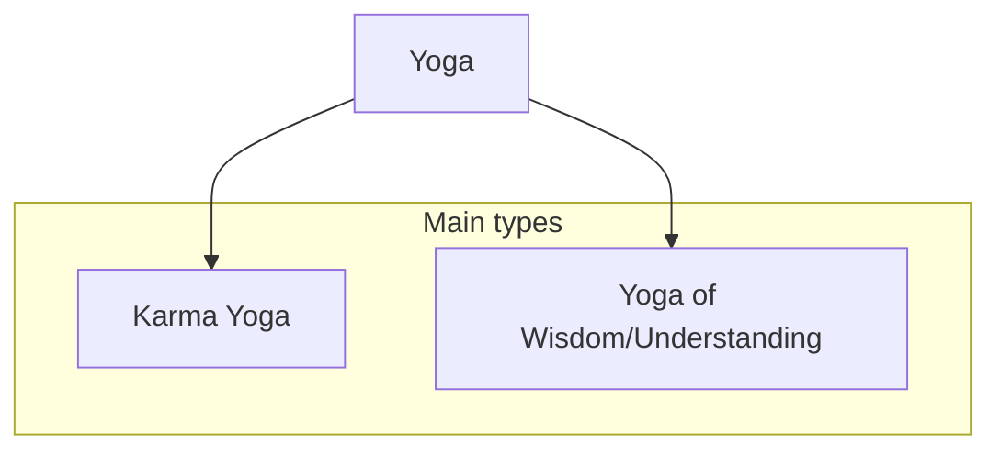

## Terminology
|Term|Means|
|--|--|
| Karma | Action |
| Yoga | Path |

## Gunas
> Everything is made up from them
### Types
- Sattva (sattvic action)
	 - Purity, hollyness
	- Self is made from it.
- Rajas (rajasic action - too much emotion)
	- Activity, passion, Energy
- Tamas (tamasic action)
	-  Ignorrence, impurity

## Types of Yoga

### Karma yoga
In short, **a path of detached action**.
What does it mean?
~~- Don't think about 
	- result
	- consequences
	- personal gain~~
- Be deteached from thinking, act selfless (Deteached action)
- Just do it because you have to, focus on the task
- *"Action is better than innaction"*
### The main thing of the chapter
"Why do are you pushing me to action Krishna, when you always say that thinking is more important?"
*"Listen, Arjuna, you, little twat. Know you place: You're warrior, the Karma Yoga is a path for **YOU**. Karma Yoga is about deteached action, so act, DO WAR!"*

