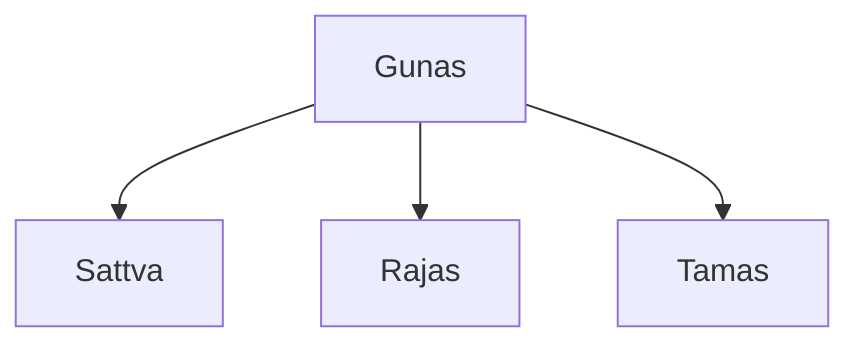
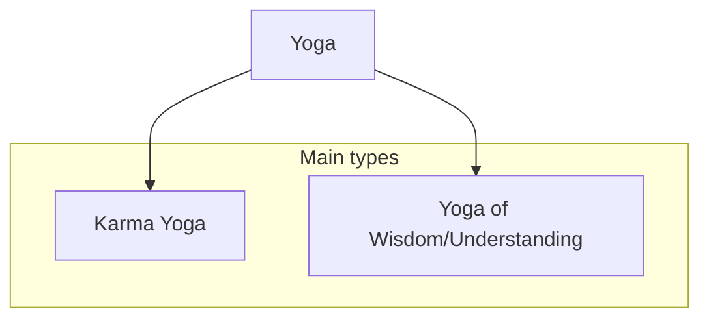

## Gunas
> Everything is made up from them
### Types
- Sattva (sattvic action)
	 - Purity, hollyness
	- Self is made from it.
- Rajas (rajasic action - too much emotion)
	- Activity, passion, Energy
- Tamas (tamasic action)
	-  Ignorrence, impurity

## Types of Yoga

### Karma yoga
In short, **a path of detached action**.
What does it mean?
- Don't think about 
	- result
	- consequences
	- personal gain
- Just do it because you have to, focus on the task
