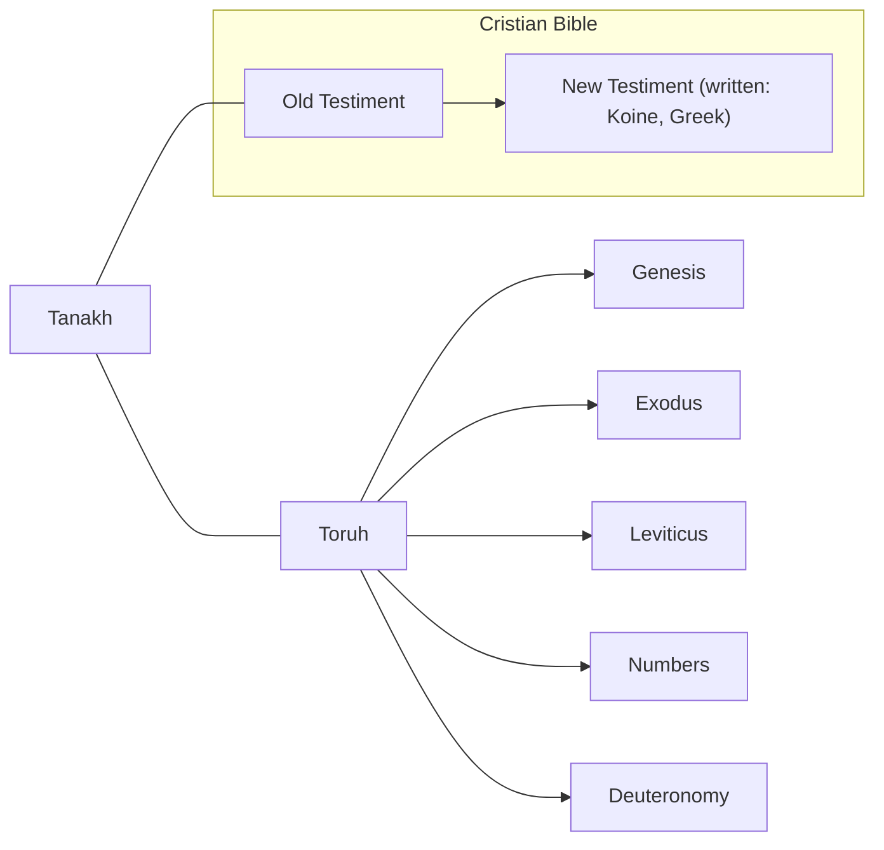

| Term | Means |
|--|--|
| Hellenized | Romanized places. A place -- not roman -- that follows Romanian traditions |
|Abrachamic|Relligions that share the tradition of Abraham|
|Monotheistic|Belief in a single god|
|Paul (original: Saul)|Has written a big part of *New Testiment* (has been writing in greek). Paul was a Jew in a Hellenized place. He wanted to populate. Epistle writer. |
|Roman| Empire (Latin)|
|Aramaic|A language that was spoken in a land of Jesus|

