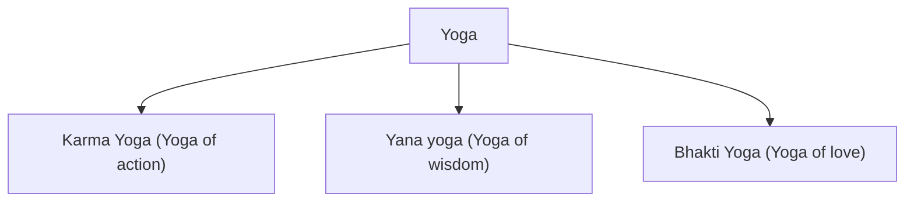

# Yogas

**Karma Yoga:**
Yoga of deteached actions

**Yana Yoga:**
Yoga of wisdom

**Bhakti Yoga:**
Yoga of love and devotion. Yoga of worshiping to Krishna.
Only through love you can vanish through krishna's bliss.
> At the end everything is elevated to love and devotion and to bliss with krishna or realize that you're one with Krishna

