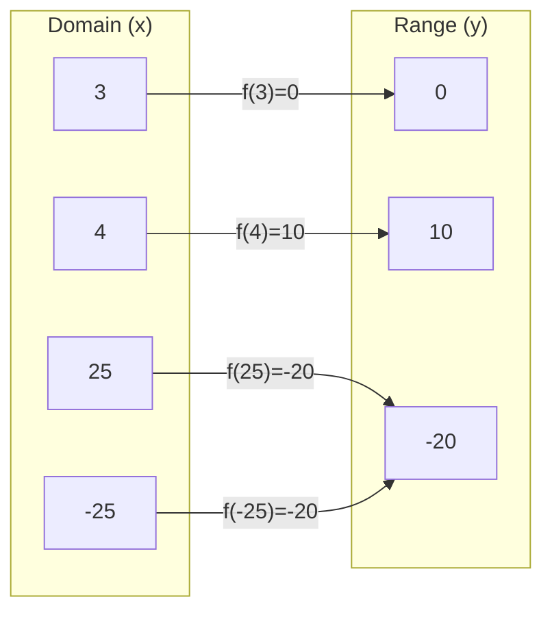
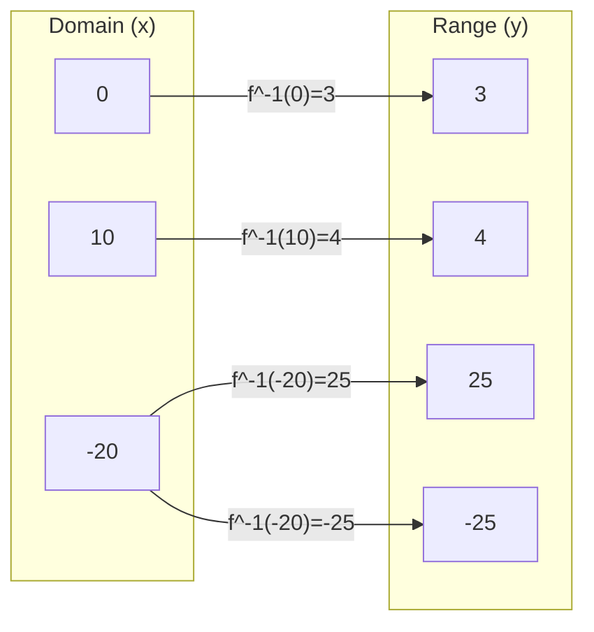
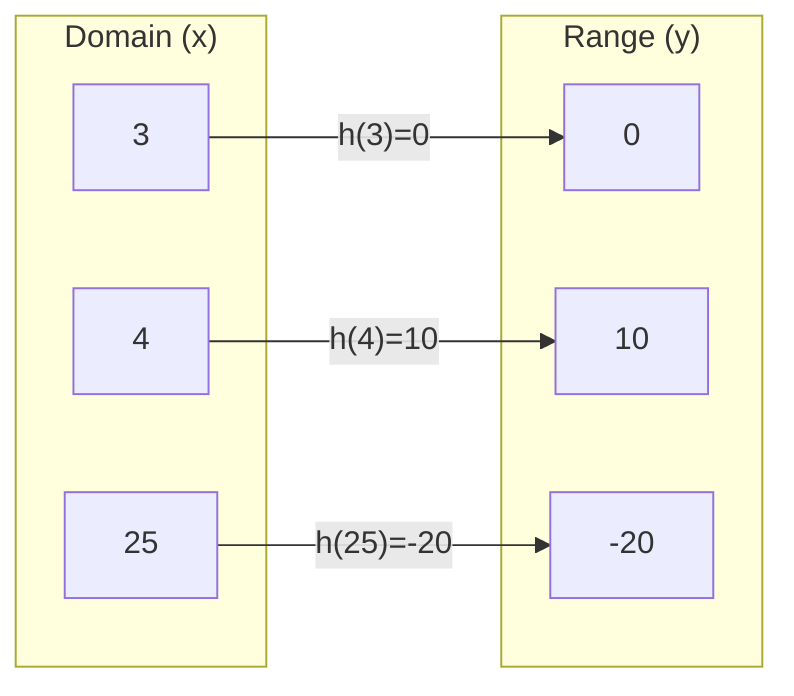
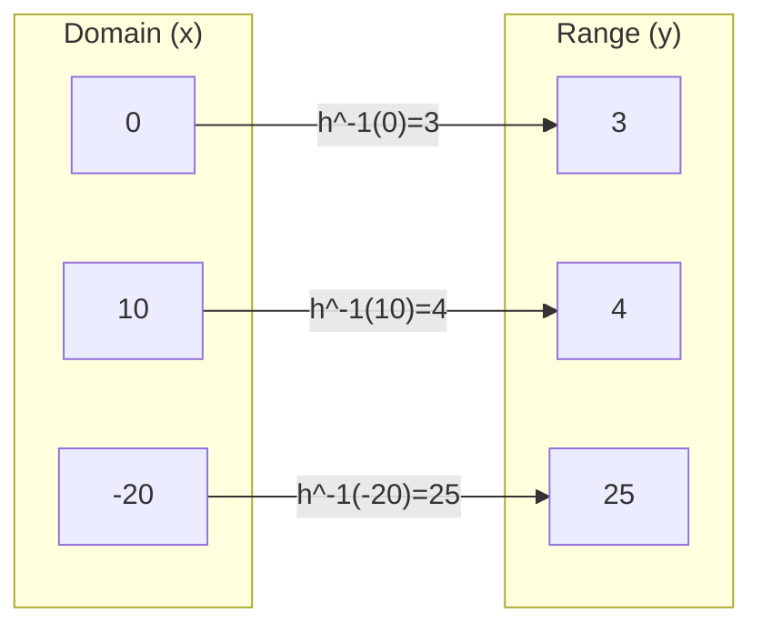

# invertibility
Knowledge Required:
- Know what is an inverse of a function
- Basic algebra
- Know the definition of a function
## When is function considered invertible?
Let's look at an imaginary function $f(x)$. For every element in the $D$omain there should be a corresponding element in the $R$ange.
$f(x)$:

And it's completely fine. Now let's invert it.
$f^{-1}(x)$:

Now there is a problem: What is $f(-20)$? We can't define it, because **we cannot get 2 values out of one function**. This is why our imaginary function $f(x)$ is NOT considered invertible.

## How can we bypass this?
Well, we can exclude either $-25$ or $25$ from the $D$omain of the $f(x)$.
let's call this new function $h(x)$ (Note: I have changed the name of a function, because we have changed the function values, so it has become a different function, "different values $\iff$ different function").
$h(x)$:

$h^{-1}(x)$:

Now it is invertable, because we didn't have any of those nasty uncertainties and had a clean one to one relationship.
## An example
Let's go over an example. 
> Let $f(x)=x^2$. Is this function invertable? Why?

The function is not invertable because we have 2 $x$ values that correspond to a single $y$ value (ex. $f(2)=f(-2)=2^2=(-2)^2$=4). So this function is not invertable.
For fun let's make it invertable. At this point, we know that we have to exclude either positve or negative inputs to avoid repetition of the outputs.
Let's find the inverse $f^{-1}(x)$:
$$f^{-1}(x) \implies x = y^2 \implies y = \sqrt{x}$$
Since $y$ of the inverse is $x$ of the function and $y$ of the inverse clearly cannot be negative (in this case), we can say that the $x$ values of the function should be only positive and zero. So the domain that make this invertable is $D(x)=[0; +\infty)$

## An algorithm
Algorithm is probably the easiest way to solve this without getting confuesd, since the inverses can be pretty confusing, especially when working with domains and ranges of the functions and their inverses.
The algorithm reads as:
> If the both  function and it's inverse are functions and the $D$omain of the function is equal to the $R$ange of it's inverse, the function is invertable.

Basically, what it says is that set of $x$ values of the function should be equal to the set of the $y$ values of it's inverse and both inverse and the function should be functions (to avoid the thing where 2 $y$ values are provided for the same $x$).
### Algorithm application
Let's solve the previous example via the algorithm.
$f(x)$ is a function, since all it's $x$ values correspond to a single $y$ value.
$f(x) = x^2\\D(x)=(-\infty; +\infty)$

$f^{-1}(x) = \sqrt{x}$
$f^{-1}(x)$ is a function, since all it's $x$ values correspond to a single $y$ value.
$\\R(f^{-1}(x))=[0; +\infty]$

$D(x) \neq R(f^{-1}(x))$; domain is not equal to range of the inverse, so this function is not invertable.

Let's make it invertable
$f(x)=x^2\\D(x) = ?\\f^{-1}=\sqrt{x}\\R(f^{-1}(x)) = [0; +\infty)\\
D(x)=R(x)=[0;+\infty)$

## Also I recommend
If you feel like you still don't get, watch the [khan academy video](https://www.youtube.com/watch?v=mPQCHmOxGlY) on this.
